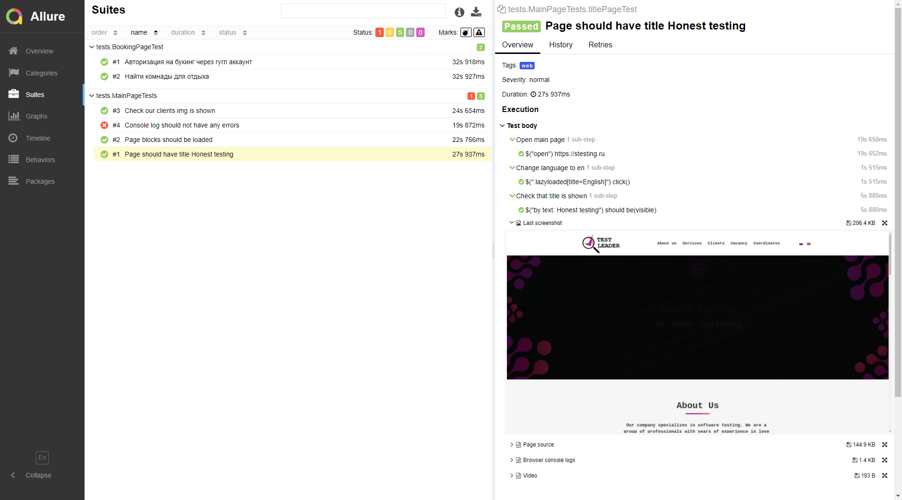
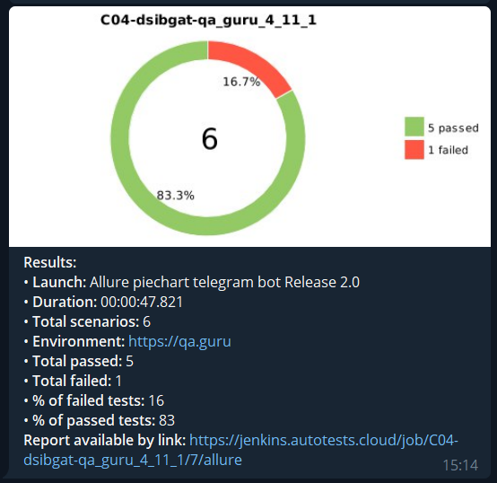

# Autotests https://stesting.ru page
## Main page test are implemented
- [X] - Main title text is shown
- [X] - All blocks should be loaded
- [X] - Page should change language
- [X] - Clients img is shown
- [X] - Console log should not have any errors

## Booking page test are implemented
- [X] - Room for holyday is found
- [X] - Autorisation by google is implemented

## Added tests video

## Added allure report

## Added telegram notification

